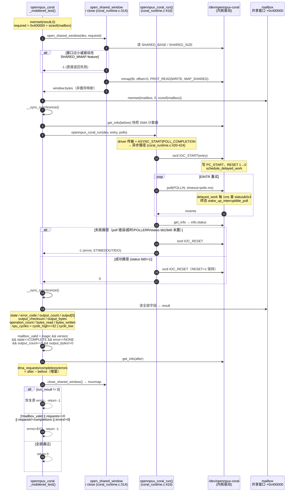
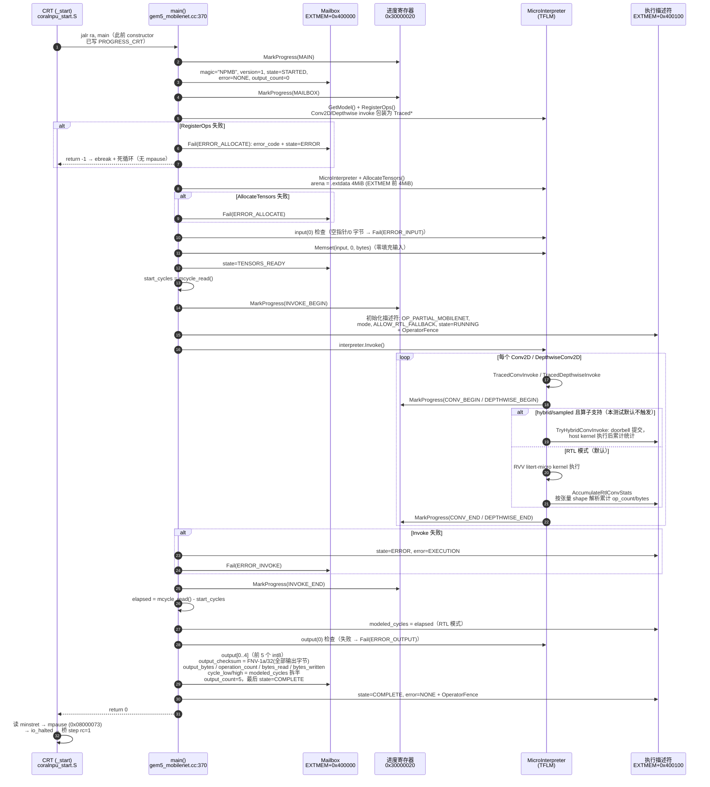
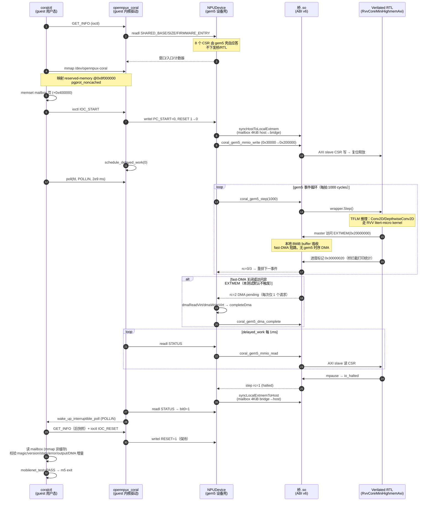

# RVV Highmem MobileNet 测试端到端分析

本文对 `./tools/coralnpu/run_rvv_mobilenet_test.sh` 入口的 RVV Highmem
MobileNet 验收测试做端到端分析，覆盖从宿主 shell 到 Coral RTL 的八个层次
（Layer 0~7）以及完整数据流。所有关键论断均给出 `path:line` 引用；行号以
本文撰写时的代码为准。验收标准与
[docs/runbooks/rvv_mobilenet_acceptance.md](../runbooks/rvv_mobilenet_acceptance.md)
保持一致。

## 1. 概述

该测试在 x86 宿主上启动 gem5 ARM64 全系统仿真，guest Linux 通过
`/dev/opennpux-coral` 驱动启动 Coral NPU 固件 `gem5_mobilenet.elf`，在
Verilated `RvvCoreMiniHighmemAxi` RTL 上执行完整
`mobilenet_v1_0.25_224_int8_dummy.tflite` 图（dummy 权重、零填充输入），
固件将结果写入共享内存 mailbox，guest 校验后打印 `mobilenet_test=PASS`。

- 入口：`tools/coralnpu/run_rvv_mobilenet_test.sh:1`
- 验收标准（`docs/runbooks/rvv_mobilenet_acceptance.md:337-358`）：
  `mobilenet_test=PASS`、`mobilenet_output_checksum` 非零、
  `mobilenet_dma_errors=0`、`mobilenet_dma_requests` 非零且等于
  `mobilenet_dma_completions`。
- 入口脚本自身**不 grep PASS**：它只负责启动仿真并透传退出行为，判定由
  guest 内 coralctl 的校验逻辑（`runtime/host/src/coral_runtime.c:871-895`）
  与 rcS 脚本的 `fail()` 路径完成。

分层视图：

| Layer | 组件                         | 关键文件                                                                                       |
| ----- | ---------------------------- | ---------------------------------------------------------------------------------------------- |
| 0     | 入口脚本与 checkpoint 管理   | `tools/coralnpu/run_rvv_mobilenet_test.sh`、`sim/gem5/run_multicore.sh`                    |
| 1     | guest 引导/测试脚本          | `runtime/host/bootscripts/coral-mobilenet-test.rcS`                                          |
| 2     | 用户态 runtime + CLI         | `runtime/host/src/coral_runtime.c`、`runtime/host/tools/coralctl.c`                        |
| 3     | Linux 内核驱动               | `runtime/kernel/opennpux_coral.c`                                                            |
| 4     | gem5 NPUDevice（设备壳）     | `sim/gem5/src/dev/npu/npu_device.cc`、`coral_verilated_backend.cc`                         |
| 5     | gem5↔RTL 桥（C ABI v6）     | `sim/coralnpu/hw_sim/gem5_bridge/coralnpu_gem5_abi.cc`、`rtl/wrappers/coralnpu_gem5_abi.h` |
| 6     | Verilated Coral RTL          | `thirdparty/coralnpu/hdl/chisel/...`                                                         |
| 7     | NPU 固件（TFLM + MobileNet） | `sim/coralnpu/hw_sim/gem5_bridge/gem5_mobilenet.cc`                                          |

### 1.1 分层速览（阅读地图）

每层一行：调用链入口 → 职责 → 详情章节。寄存器表、mailbox ABI、step
协议等细节只在对应正文出现一次，本节不重复。

- **L0 入口与 checkpoint**（§2）：`run_rvv_mobilenet_test.sh` →
  `apply_patchset.sh` → `exec run_multicore.sh`；注入
  bridge/firmware/窗口参数，按 `.shared_base` sidecar 判 checkpoint
  失效，bootstrap 后自动 restore。
- **L1 guest 测试脚本**（§3）：`coral-mobilenet-test.rcS` → 条件挂载 →
  `.ready` 守卫 → `insmod opennpux_coral.ko` →
  `coralctl mobilenet-test 0x1D000000 2000000000`。
- **L2 用户态 runtime**（§4）：`opennpux_coral_mobilenet_test()`：
  GET_INFO → mmap 共享窗口 → 清零 mailbox → IOC_START → `poll()` →
  读 mailbox → 增量 DMA 统计 → 全部校验（§4.4）。
- **L3 内核驱动**（§5）：IOC_START 写 PC_START、RESET 1→0、
  `schedule_delayed_work`；worker 每 1 ms 查 `status & 0x3`，终态
  `wake_up_interruptible_poll` 唤醒 `poll()`；IOC_RESET 保持复位。
- **L4 gem5 设备壳**（§6）：MMIO 分发——8 个 CSR 自应答，其余转桥；
  事件循环每拍 `step(1000)`，按 rc 0/1/2/3/4 分派
  （halt/DMA/WFI/fault）；fast-DMA 4 KiB 页缓存 + mailbox 页双向同步。
- **L5 桥（C ABI v6）**（§7）：CSR 窗口 `0x30000→0x200000` 翻译后由
  RTL AXI slave 执行；本地 8 MiB EXTMEM 吸收 tensor 流量；master 侧
  拦截 hybrid doorbell 与固件进度标记。
- **L6 Verilated RTL**（§8）：`RvvCoreMiniHighmemAxi`（ITCM/DTCM 各
  1 MiB，EXTMEM @ `0x20000000`）；`mpause` → `io_halted` → step rc=1。
- **L7 NPU 固件**（§9）：CRT `_start` → `main()` → TFLM `Invoke()`
  （Conv2D/DepthwiseConv2D 走 RVV 优化 kernel，其余 8 个算子走 TFLM
  reference）→ 写 mailbox（FNV-1a checksum、mcycle 计数）→ `mpause`。

简化数据流（完整版见 §10）：

```text
启动:  coralctl IOC_START → 驱动写 PC_START、RESET 1→0 → gem5壳(0x30000)
       → 桥(翻译 0x200000) → RTL 核释放复位
执行:  gem5 事件循环 step(1000 cycles/拍) → RTL 跑 TFLM；EXTMEM 访问被桥本地
       8MiB buffer 吸收（fast-DMA 短路：无 gem5 时序 DMA；mailbox 4KiB 页是
       唯一 host↔bridge 同步区）
完成:  固件 mpause → io_halted → step rc=1 → STATUS bit0
       → 驱动 delayed_work(1ms) wake poll
收尾:  coralctl poll 返回 → GET_INFO → IOC_RESET(RESET=1 保持)
       → 读 mailbox(mmap 非缓存) → 校验 magic/version/state/error/output/DMA
       增量 → mobilenet_test=PASS
```

## 2. Layer 0：入口脚本与 checkpoint 管理

### 2.1 脚本不是直接起 gem5

`run_rvv_mobilenet_test.sh` 先做前置检查与 checkpoint 失效判断，然后执行
overlay 合并，最后 `exec` 进入通用启动器：

- overlay 合并：`sim/gem5/apply_patchset.sh`
  （`tools/coralnpu/run_rvv_mobilenet_test.sh:184`），把 `sim/gem5/` 的本地
  delta 同步进 `thirdparty/gem5/`。
- 启动器：`exec thirdparty/gem5/run_multicore.sh`
  （`tools/coralnpu/run_rvv_mobilenet_test.sh:209`），环境变量在
  `tools/coralnpu/run_rvv_mobilenet_test.sh:193-208` 一次性注入。

### 2.2 关键默认参数

- bridge：`build/coralnpu/libcoralnpu_gem5_rvv_highmem_bridge.so`
  （`tools/coralnpu/run_rvv_mobilenet_test.sh:66`）
- firmware：`build/coralnpu/gem5_mobilenet.elf`（同文件 `:67`）
- resume bootscript：`thirdparty/gem5/configs/coralnpu/coral-mobilenet-test.rcS`
  （同文件 `:68`，即 overlay 副本，内容与
  `runtime/host/bootscripts/coral-mobilenet-test.rcS` 逐字节一致）
- `CORAL_RTL_CYCLES_PER_EVENT=1000`（同文件 `:74`）
- `CORAL_FAST_DMA_EVENT_BATCH=4096`（同文件 `:75`）
- `CORAL_OPERATOR_MODE=rtl`（同文件 `:76`）。注意脚本头注释在
  `tools/coralnpu/run_rvv_mobilenet_test.sh:27` 仍称 sampled 是
  "Default bring-up mode"，与 `:36`、`:76` 的实际默认 `rtl` 矛盾——本文仅
  标注该注释过时，不改代码。runbook 也称 "`rtl` is the default for
  backward compatibility"（`docs/runbooks/rvv_mobilenet_acceptance.md:70`），
  但同时在 `:380` 建议 "Use `sampled` mode for full-graph acceptance"。
- fast-DMA 默认开启：`CORAL_FAST_DMA` 默认 1 时追加 `--npu-fast-dma`
  （`tools/coralnpu/run_rvv_mobilenet_test.sh:84-85`）。

### 2.3 共享内存窗口与 checkpoint

- 共享窗口：8 MiB @ `0x8f000000`，由 `CORAL_CONFIG_OPTIONS` 传入
  `--npu-dma-shared-base/--npu-dma-shared-size/--npu-operator-mode/ --npu-fast-dma/--npu-fast-dma-event-batch`
  （`tools/coralnpu/run_rvv_mobilenet_test.sh:93`、`:207`）。注意这不同于
  gem5 配置默认值 4 KiB @ `0x8FF00000`
  （`sim/gem5/configs/example/arm/arm_multicore_d9300.py:546-555`），因此
  MobileNet 使用专用 checkpoint。
- 专用 checkpoint 根：`checkpoint/coralnpu_mobilenet_ckpt`
  （`tools/coralnpu/run_rvv_mobilenet_test.sh:92`）。
- 失效依据：sidecar 文件 `${CKPT_ROOT}.shared_base`
  （`tools/coralnpu/run_rvv_mobilenet_test.sh:94`）；若已存在 checkpoint 但
  sidecar 内容与当前 `DMA_SHARED_BASE` 不一致则整树删除重建
  （同文件 `:169-176`）。这叠加在 `run_multicore.sh` 自身的八项失效条件
  之上（`sim/gem5/run_multicore.sh:208-288`）。
- `CORAL_AUTO_RESUME_AFTER_CKPT=1`
  （`tools/coralnpu/run_rvv_mobilenet_test.sh:204`）：首次运行 bootstrap
  完创建 checkpoint 后，`run_multicore.sh` 通过 `exec "$0"` 自动进入
  restore 分支执行测试（`sim/gem5/run_multicore.sh:407-411`）。

### 2.4 run_multicore.sh 的职责

- 后端校验：verilated-coral 模式要求 bridge/firmware 存在，并用 `ldd`
  拒绝链接了 libsystemc 的 bridge（`sim/gem5/run_multicore.sh:143-165`）。
- 环境变量到 gem5 参数的转换：`CORAL_RTL_BRIDGE` →
  `--npu-verilated-wrapper`（`sim/gem5/run_multicore.sh:124`、`:161`），
  `CORAL_RTL_FIRMWARE` → `--npu-rtl-firmware`（`:125`、`:162`），
  `CORAL_RTL_TICK_PERIOD`（默认 `1ns`）/ `CORAL_RTL_CYCLES_PER_EVENT`
  （默认 1）在 `:126-127` 读取、`:163-164` 转发。
  `CORAL_FAST_DMA_EVENT_BATCH` **不被** `run_multicore.sh` 直接读取，它经
  `CORAL_CONFIG_OPTIONS` 透传（见 2.3）。
- 两种运行模式：checkpoint 存在则 restore + `--bootscript` 注入
  resume 脚本（`sim/gem5/run_multicore.sh:367-382`）；否则 stage-a
  bootstrap + `--exit-after-checkpoint`
  （`sim/gem5/run_multicore.sh:383-399`）。
- gem5 配置默认 `arm_multicore_d9300.py`
  （`sim/gem5/run_multicore.sh:131`）；NPU 孔径默认 `0x1D000000`、大小
  `0x31000`（`sim/gem5/configs/example/arm/arm_multicore_d9300.py:480-489`）。

### 2.5 bootstrap 期预置 /tmp 载荷

checkpoint bootstrap 阶段执行 `boot-to-checkpoint.rcS`，把测试载荷复制进
tmpfs（tmpfs 内容随 gem5 checkpoint 一起保存）：

- coralctl：`sim/gem5/configs/coralnpu/boot-to-checkpoint.rcS:16-29`
- opennpux_coral.ko：同文件 `:31-42`
- busybox：同文件 `:44-49`
- 三者齐备时写守卫文件 `/tmp/coralnpu-phase3-preload.ready`
  （同文件 `:65-72`），restore 后的测试脚本据此识别陈旧 checkpoint。

restore 后执行流：`/sbin/m5 --inst checkpoint` 返回点继续 →
`m5 readfile` 取出本次 gem5 调用注入的 resume 脚本 → `exec /bin/sh`
执行（`sim/gem5/configs/coralnpu/boot-to-checkpoint.rcS:89-105`）。这保证
resume 脚本永远来自当前命令行而非 checkpoint 内的旧副本。

## 3. Layer 1：guest 测试脚本

`runtime/host/bootscripts/coral-mobilenet-test.rcS`（与 gem5 侧 overlay
副本一致）逻辑极简：

1. 条件挂载 proc/sysfs/tmpfs/devtmpfs
   （`runtime/host/bootscripts/coral-mobilenet-test.rcS:3-13`）——restore
   后这些挂载点可能已存在，故逐项检查。
2. 陈旧 checkpoint 守卫：`/tmp/coralnpu-phase3-preload.ready` 不存在即
   `fail "stale checkpoint"`（同文件 `:28`）。
3. 驱动加载：仅当 `/dev/opennpux-coral` 不存在时
   `/tmp/busybox insmod /tmp/opennpux_coral.ko`（同文件 `:33-36`）；
   insmod 失败被 `|| true` 吞掉，随后 `:36` 的设备节点检查才是真正判定。
4. 执行测试：
   `OPENNPUX_CORAL_TRANSPORT=driver /tmp/coralctl mobilenet-test 0x1D000000 2000000000`
   （同文件 `:38-39`）。`2000000000` 是 poll 参数，语义见 Layer 2。
5. 失败路径：`fail()` 打印后 `m5 --inst exit`（同文件 `:19-25`）；
   成功路径打印 `[coral-mobilenet-test] PASS` 后退出仿真
   （同文件 `:42-45`）。

## 4. Layer 2：用户态 runtime 与 coralctl

### 4.1 参数语义

- CLI 形式：`mobilenet-test [base [poll-count]]`
  （`runtime/host/tools/coralctl.c:20`）；参数个数与解析在
  `runtime/host/tools/coralctl.c:279`、`:316-320`、`:393-403`。
- **固件入口不是 CLI 参数**：coralctl 先 GET_INFO，用
  `info.firmware_entry` 作为入口（`runtime/host/tools/coralctl.c:380-382`），
  该值由 gem5 从固件 ELF 的 `e_entry` 提供（见 Layer 4/5）。
- **poll-count 的语义依传输路径而变**：driver 异步路径下它被当作
  `poll()` 的超时毫秒数（上限 INT_MAX，
  `runtime/host/src/coral_runtime.c:436-439`）。本测试传入 2×10⁹ ms
  ≈ 23.1 天，即事实上的无限等待。只有 legacy IOC_RUN / devmem 路径才把
  它当忙等次数（`runtime/host/src/coral_runtime.c:473-491`、`:499-504`）。

### 4.2 传输选择

`opennpux_coral_open()` 默认优先打开 `/dev/opennpux-coral` 并用
`OPENNPUX_CORAL_IOC_GET_CAPS` 协商特性；`OPENNPUX_CORAL_TRANSPORT=driver`
强制要求驱动路径成功，失败即报错，不会回退 `/dev/mem`
（`runtime/host/src/coral_runtime.c:102-178`，环境变量读取在
`:117-123`）。本测试 rcS 显式设置 `=driver`。

### 4.3 opennpux_coral_mobilenet_test() 执行序列

位于 `runtime/host/src/coral_runtime.c:829-897`：

1. `open_shared_window`：driver 传输下先 GET_INFO 读 `SHARED_BASE`/
   `SHARED_SIZE` CSR（`runtime/host/src/coral_runtime.c:320-321`），检查
   `OPENNPUX_CORAL_FEATURE_SHARED_MMAP` 特性位（同文件 `:330-335`），然后
   对整个窗口 `mmap`（同文件 `:337-351`）。
2. memset 清零 mailbox 结构体并 `__sync_synchronize()`
   （`runtime/host/src/coral_runtime.c:842-846`）。
3. GET_INFO 前快照（同文件 `:847-849`）。
4. `opennpux_coral_run()`：因 GET_CAPS 宣称 ASYNC_START |
   POLL_COMPLETION（见 Layer 3），走异步路径——
   `OPENNPUX_CORAL_IOC_START` → `poll(POLLIN)` → GET_INFO → 成功/失败后
   `OPENNPUX_CORAL_IOC_RESET`
   （`runtime/host/src/coral_runtime.c:420-470`）。
5. 再次 barrier（同文件 `:854`），读 mailbox 各字段，64 位周期数由
   `cycle_high << 32 | cycle_low` 合成（同文件 `:856-870`）。
6. GET_INFO 后快照并做增量 DMA 统计（同文件 `:879-883`）。
7. 校验（见下）。

同一执行序列的 Mermaid 时序图：



两个容易看漏的细节：**失败路径也会先读 mailbox 和 after 快照、munmap
之后才返回**（`runtime/host/src/coral_runtime.c:851-889`），caller 因此能
拿到部分现场用于诊断；run 失败的 `errno` 在 `:853` 保存、`:887` 恢复，
避免被后续调用覆盖。

### 4.4 校验条件比直觉更严

`mailbox_valid`（`runtime/host/src/coral_runtime.c:871-877`）要求同时满足：
`magic == 0x4E504D42`（"NPMB"）、`version == 1`、
`state == COMPLETE(3)`、**`error_code == 0`、`output_count == 5`、
`output_bytes != 0`**；随后还要求 DMA 增量
`requests > 0 && requests == completions && errors == 0`
（`runtime/host/src/coral_runtime.c:890-895`）。也就是说固件只写 magic
和 state 是不够的，输出张量必须真实产生。

### 4.5 mailbox ABI

mailbox 布局定义在 `runtime/host/include/opennpux/coral_mobilenet.h:37-51`
（与桥侧 `sim/coralnpu/hw_sim/gem5_bridge/coral_mobilenet.h:37-51` 是双副
本，同步性由 `tools/coralnpu/check_mobilenet_abi.sh` 保证）：

- `magic=0x4E504D42`、`version=1`（`runtime/host/include/opennpux/coral_mobilenet.h:6-7`）
- 字段顺序：`magic, version, state, error_code, cycle_low, cycle_high, output_count, int32 output[5], output_checksum, output_bytes, u64 operation_count, u64 bytes_read, u64 bytes_written`
- 窗口内偏移 `MAILBOX_OFFSET = 0x400000`（同文件 `:9`）；前 4 MiB
  （`ARENA_SIZE`，同文件 `:8`）是固件 tensor arena 对应的 EXTMEM 区。
- 进度标记常量 `PROGRESS_*` 与进度寄存器地址 `0x30000020`
  （同文件 `:11-24`）。

### 4.6 输出格式

`print_mobilenet_test()`（`runtime/host/tools/coralctl.c:205-242`）依次打
印 `mobilenet_prepare`/`mobilenet_run`/`status`/`mobilenet_state`/
`mobilenet_error`/`mobilenet_npu_cycles`/`mobilenet_output_checksum`/
`mobilenet_output_bytes`/`mobilenet_operation_count`/`mobilenet_bytes_read`/
`mobilenet_bytes_written`/`mobilenet_dma_requests`/
`mobilenet_dma_completions`/`mobilenet_dma_errors`/前 5 个 output 值，最
后 `mobilenet_test=PASS`。`mobilenet_run=started` 在启动前 `fflush`
（`runtime/host/tools/coralctl.c:210-212`），用于区分"卡在 guest 初始化"
与"卡在 RTL 推理"。

## 5. Layer 3：Linux 内核驱动

`runtime/kernel/opennpux_coral.c` 是最小 platform 驱动，MMIO 基址与窗口大
小来自 DT reg（gem5 生成 DT 见 Layer 4），寄存器偏移定义在
`runtime/kernel/opennpux_coral.c:32-42`，与 runtime 侧
`runtime/host/src/coral_runtime.c:19-29` 一致：

`RESET_CONTROL=0x30000`、`PC_START=0x30004`、`STATUS=0x30008`、
`DMA_ERRORS=0x30fe0`、`DMA_REQUESTS=0x30fe4`、`DMA_COMPLETIONS=0x30fe8`、
`DMA_STATE=0x30fec`、`SHARED_BASE=0x30ff0`、`SHARED_SIZE=0x30ff4`、
`FIRMWARE_ENTRY=0x30ff8`、`BACKEND_ID=0x30ffc`。

### 5.1 ioctl 面

- `GET_INFO` → `coral_fill_info`（`runtime/kernel/opennpux_coral.c:73-88`），
  `FIRMWARE_ENTRY` 在 `:79` 读 CSR。
- `GET_CAPS`（`:200-212`）宣称 `SHARED_MMAP | ASYNC_START | POLL_COMPLETION | RESET` 四特性——因此 runtime **永远**走异步路径，
  legacy `IOC_RUN` 在本测试中不会被使用。
- `IOC_START` → `coral_start`（`:113-134`）：`running` 原子守卫
  （`-EBUSY`）、`cancel_delayed_work_sync`、写 `PC_START`、
  `RESET_CONTROL` 写 1 再写 0（脉冲式复位释放），
  `schedule_delayed_work(..., 0)` 立即挂上完成监测。
- `IOC_RUN` → `coral_run`（`:146-174`）：legacy 同步忙等 `STATUS`，
  `cpu_relax()` 让步。
- `IOC_RESET` → `coral_reset`（`:136-144`）：取消 delayed work，
  `RESET_CONTROL=1` **并保持**（释放留给下一次 START），
  `wake_up_interruptible_poll(..., POLLERR)`。

### 5.2 完成检测：delayed work + poll

- `coral_completion_work`（`runtime/kernel/opennpux_coral.c:90-111`）：读
  `STATUS`，**`status & 0x3`**（done=bit0 或 error=bit1 任置位即视为终
  态）→ 清 `running` 并以 `POLLIN|POLLRDNORM|POLLERR` 唤醒；否则以
  `msecs_to_jiffies(1)`（1 ms）重排自身。这是轮询而非中断——驱动注释
  也说明 "delayed work is used until the platform wires a real
  interrupt"（同文件 `:7-8`）。
- `coral_poll`（`:230-244`）：直读 `STATUS`，bit1 → `POLLERR`，bit0 →
  `POLLIN|POLLRDNORM`。注意 poll 里 `status & 0x3` 时也会清 `running`
  （`:237-238`），与 delayed work 存在双清路径，靠原子量保证安全。

### 5.3 mmap 与 probe 交叉校验

- `coral_mmap`（`:246-262`）：对 DT reserved-memory 窗口做边界检查，
  `VM_IO | VM_DONTEXPAND | VM_DONTDUMP`，`pgprot_noncached`，
  `remap_pfn_range` 建立非缓存映射。这是 guest 看到 mailbox 的唯一通道。
- `coral_probe`（`:298-383`）：解析 `memory-region` phandle 得到 DT
  reserved-memory 窗口后，与设备 `SHARED_BASE`/`SHARED_SIZE` CSR 交叉比
  对，不一致则 probe 失败（`:322-345`）。这条不变式保证 "DT 声明的窗
  口 == gem5 设备实际窗口"。

## 6. Layer 4：gem5 NPUDevice 设备壳

`NPUDevice` 是 `DmaVirtDevice` 子类（`sim/gem5/src/dev/npu/npu_device.hh:26`；
SimObject 声明 `sim/gem5/src/dev/npu/NPUDevice.py:16`），拥有 SoC 侧 MMIO
孔径与 DMA 端口，执行语义委托给可插拔后端
（`sim/gem5/src/dev/npu/coral_backend.hh:38-58`）。后端选择在
`sim/gem5/src/dev/npu/npu_device.cc:76-90`：`stage-a` 或
`verilated-coral`；本测试用后者，构造时把 `p.fastDma` 作为
`enable_local_extmem` 传入（`sim/gem5/src/dev/npu/npu_device.cc:83-85`）。

### 6.1 gem5 壳自实现的 8 个 CSR

`NPUDevice::read`（`sim/gem5/src/dev/npu/npu_device.cc:407-457`）在设备壳
层直接应答以下 CSR，**不下发到桥/RTL**：

- `0x30fe0/0x30fe4/0x30fe8`：DMA errors/requests/completions 计数
  （壳内成员变量）
- `0x30fec`：DMA state（`backend->hasDmaRequest()` 与 `dmaActive` 合成）
- `0x30ff0/0x30ff4`：`SHARED_BASE`/`SHARED_SIZE`（即 SimObject 参数
  `dmaSharedBase/dmaSharedSize`）
- `0x30ff8`：`FIRMWARE_ENTRY`（固件 ELF 的 `e_entry`，加载时记录）
- `0x30ffc`：`BACKEND_ID`（`0x4e505502` = verilated-coral）

写路径只在 `0x30000`（RESET_CONTROL）做 fast-DMA 记账
（`sim/gem5/src/dev/npu/npu_device.cc:466-484`）：值低两位为 0（复位释
放/启动）时先 `syncHostToLocalExtmem()`；bit0 置位（复位有效）时
`invalidateFastDmaCache()`。**写仍然转发给桥**（`:473`），RTL 侧同样看
到复位脉冲。其余所有偏移经
`CoralVerilatedBackend::read/write`
（`sim/gem5/src/dev/npu/coral_verilated_backend.cc:265-314`）以
`mmioRead/mmioWrite` 进桥。

### 6.2 桥加载与固件加载都在 gem5 侧完成

- `dlopen(RTLD_NOW | RTLD_LOCAL)` + 逐项 `dlsym` + ABI 版本检查
  （`sim/gem5/src/dev/npu/coral_verilated_backend.cc:105-131`）；析构时
  `dlclose`（同文件 `:255-263`）。
- `createModel()` 无参调用（同文件 `:133`），随后 `reset`、
  `extmemEnable(localExtmemEnabled)`（`:136-139`），再把
  rtl/hybrid/sampled 映射为 0/1/2 调 `coral_gem5_operator_mode`
  （`:140-153`）；sampled 被桥拒绝时回退 hybrid 并 `warn`（`:146-152`）。
- `loadFirmware()`（`:163-253`）：解析 ELF32，逐 `PT_LOAD` 段处理——
  `p_paddr >= 0x20000000` 的段走 `extmemWrite` 进桥本地 EXTMEM
  （`:207-222`），其余段走 `mmioWrite` 进 TCM 并 read-back 校验
  （`:223-249`）；`e_entry` 记入 `firmwareEntry`（`:252`）。
- 本测试固件 `build/coralnpu/gem5_mobilenet.elf` 的布局（`readelf` 实
  测）：入口 `0x0`；`LOAD@0x0`（ITCM，`.text/.crt/.rodata`，约
  0x7e220 字节，R E）；`LOAD@0x100000`（DTCM，`.data/.bss/.heap/.stack`，
  MemSiz 1 MiB）；`LOAD@0x20000000`（`.extdata`，4 MiB，即 tensor
  arena，进桥本地 EXTMEM）。

### 6.3 事件调度与 step 返回码协议

- 复位释放检测在 `CoralVerilatedBackend::write`
  （`sim/gem5/src/dev/npu/coral_verilated_backend.cc:299-310`）：RESET
  与 clock-gate 位都清零时 `running=true`，
  `pendingEventTick = curTick() + rtlTickPeriod`（`:309`）。
- 每个事件 `processEvent()` 调一次 `step(handle, rtlCyclesPerEvent)`
  （`:352`），本测试 `rtlCyclesPerEvent=1000`；实际推进的周期数乘以
  `rtlTickPeriod` 得到下一次事件时刻（`:356-361`、`:430`）。
- `coral_gem5_step` 返回码（实现见
  `sim/coralnpu/hw_sim/gem5_bridge/coralnpu_gem5_abi.cc:727-757`）：
  `0`=正常推进、`1`=halted、`2`=DMA pending、`3`=WFI、`4`=fault。
- **DMA 服务不是 while 轮询**：step 返回 2 后 gem5 取且仅取一个请求，
  `fatal_if(dmaRequestGet(...) != 1)`
  （`sim/gem5/src/dev/npu/coral_verilated_backend.cc:393-412`，fatal 在
  `:396`；`coral_gem5_dma_request_get` 返回 1/0/-1，见
  `sim/coralnpu/hw_sim/gem5_bridge/coralnpu_gem5_abi.cc:765-777`）。取出
  请求后 `pendingEventTick=0`（deschedule），等 DMA 完成再重新 arm
  （`sim/gem5/src/dev/npu/coral_verilated_backend.cc:412`、`:455`）。
- fault 路径读 `mepc/mtval/mcause`（偏移 `0x30104/0x30108/0x3010c`）
  后 `fatal`（`sim/gem5/src/dev/npu/coral_verilated_backend.cc:28-30`、
  `:363-375`）——RTL 故障直接终止仿真。
- DMA 完成链：`NPUDevice::processBackendEvent` →
  `backend->processEvent()` → `startBackendDma()` →（timing 模式）
  `dmaReadVirt/dmaWriteVirt` → `completeBackendDma()` →
  `backend->completeDma()` → `coral_gem5_dma_complete`
  （`sim/gem5/src/dev/npu/npu_device.cc:151-231`、`:357-373`；
  `sim/gem5/src/dev/npu/coral_verilated_backend.cc:441-456`）。

### 6.4 fast-DMA 与本地 EXTMEM 短路

本测试默认 `--npu-fast-dma`，两条功能加速路径生效：

1. **gem5 侧页缓存**：`startBackendDma` 在 fast-DMA 下不发 timing DMA，
   而是 `fastDmaAccess`（4 KiB 页缓存 + functional 访问）后立即
   `completeBackendDma`（`sim/gem5/src/dev/npu/npu_device.cc:217-222`、
   `:264-294`）；脏页在批次结束且无 pending 事件时
   `flushFastDmaCache` 回写（`:171-174`、`:296-310`）。
2. **桥侧本地 EXTMEM**（见 Layer 5）：`p.fastDma` 同时作为
   `enable_local_extmem`，RTL master 对 EXTMEM 的绝大多数访问被桥内
   8 MiB buffer 吸收，根本不产生到 gem5 的 DMA 请求。

`fastDmaEventBatch=4096` 是 `processBackendEvent` 的批预算：fast-DMA 下
单次 gem5 事件最多循环处理 4096 个 "step + DMA" 批次，减少事件调度开销
（`sim/gem5/src/dev/npu/npu_device.cc:151-167`）。

### 6.5 地址翻译与 mailbox 同步区

- Coral 侧地址到宿主物理地址：
  `hostAddr = dmaSharedBase + (addr - dmaExtmemBase(0x20000000))`
  （`sim/gem5/src/dev/npu/npu_device.cc:199-200`）；DMA 请求先做 EXTMEM
  窗口边界校验，越界走 `completeBackendDmaError`（`:186-198`）。
- mailbox 页（EXTMEM+`0x400000`，4 KiB，参数 `fastDmaSyncOffset`/
  `fastDmaSyncSize`，`sim/gem5/src/dev/npu/NPUDevice.py:87-94`）是
  fast-DMA 下**唯一**的 host↔bridge 同步区：
  - 启动前（复位释放写 0x30000）`syncHostToLocalExtmem()` 把宿主窗口的
    mailbox 页拷进桥本地 EXTMEM（`sim/gem5/src/dev/npu/npu_device.cc:466-471`、
    `:319-337`）——guest memset 的清零状态由此进入 RTL 视图；
  - 批次结束且无 pending 事件/DMA 时 `syncLocalExtmemToHost()` 把桥内
    mailbox 页回写宿主窗口（`:168-170`、`:339-354`）——固件写的结果由
    此进入 guest 视图。
  - 两次 sync 各自 `++dmaRequests; ++dmaCompletions`
    （`:331-332`、`:348-349`），这正是 fast-DMA 下 DMA 计数非零的来源
    （满足 4.4 的 `requests > 0` 校验）。
- DT 生成：`NPUDevice.py` 的 `generateDeviceTree` 输出
  reserved-memory（`no-map`）+ `memory-region` phandle +
  `google,dma-extmem-base`（`sim/gem5/src/dev/npu/NPUDevice.py:96-132`），
  即 Layer 3 probe 交叉校验的另一端。

## 7. Layer 5：gem5↔RTL 桥（C ABI v6）

### 7.1 ABI 契约

规范头 `rtl/wrappers/coralnpu_gem5_abi.h`（三副本：`rtl/wrappers/`、
`sim/coralnpu/`、`sim/gem5/`，同步性由
`tools/coralnpu/phase2_check_abi.sh` 校验）：

- `CORAL_GEM5_ABI_VERSION 6`（`rtl/wrappers/coralnpu_gem5_abi.h:11`），
  AXI 数据宽 16 B、DMA 数据缓冲 4096 B（`:12-13`）。
- 导出函数：`abi_version/create/destroy/reset/mmio_read/mmio_write/step/ cycle_count/dma_request_get/dma_complete/extmem_enable/extmem_read/ extmem_write/operator_mode`（`:30-49`）。
- **`coral_gem5_create(void)` 无参数**
  （`sim/coralnpu/hw_sim/gem5_bridge/coralnpu_gem5_abi.cc:669-673`）：
  tick period、cycles-per-event 等时序参数不跨 ABI，由 gem5 侧自行换
  算（见 6.3）。桥侧延迟模型参数从环境变量读
  （`CORAL_HYBRID_OPS_PER_CYCLE/BYTES_PER_CYCLE/FIXED_CYCLES`，
  `sim/coralnpu/hw_sim/gem5_bridge/coralnpu_gem5_abi.cc:341-345`），
  `CORAL_SAMPLED_RTL_OPS` 由 `ParseSampledRtlMask` 在 create 时解析
  （`:134-181`、`:332`）。
- `coral_gem5_dma_request`：`u32 type/addr/size/id + data[4096]`
  （`rtl/wrappers/coralnpu_gem5_abi.h:20-26`）；gem5 侧镜像为
  `CoralDmaRequest`（`sim/gem5/src/dev/npu/coral_backend.hh:30-36`）。

### 7.2 MMIO 从通路：CSR 由 RTL 执行

桥把 gem5 壳的 CSR 窗口 `0x30000-0x30fff` 翻译成 highmem RTL 的 CSR 基址
`0x200000`（`TranslateSlaveAddress`，
`sim/coralnpu/hw_sim/gem5_bridge/coralnpu_gem5_abi.cc:32-45`，该翻译仅在
`CORAL_GEM5_RVV_HIGHMEM` 编译下启用），然后通过 AXI slave 驱动进
Verilated 模型（`sim/coralnpu/hw_sim/gem5_bridge/gem5_core_mini_axi_wrapper.h:119-152`）。
也就是说 `RESET_CONTROL/PC_START/STATUS` 等控制寄存器的行为由 RTL 本身
执行，桥不做软件模拟——gem5 侧读到的 `STATUS` bit0 就是 RTL
`io_halted` 经 CSR 块暴露的值。

### 7.3 master 侧拦截：hybrid 门铃与自定义寄存器

RTL master 发出的 AXI 事务由桥的 deferred 回调分类服务
（`sim/coralnpu/hw_sim/gem5_bridge/coralnpu_gem5_abi.cc:365-465` 读、
`:466-658` 写）：

- **hybrid 算子 MMIO 块** `0x30000100-0x300001ff`：mode/doorbell(+0x04)/
  status(+0x08)/capabilities(+0x0c)/sampled-mask(+0x10)
  （`sim/coralnpu/hw_sim/gem5_bridge/coral_operator.h:9-18`），由桥 C++
  直接应答，不进 RTL（这些地址本就在 RTL CSR 窗口之外）。
- **自定义 MAC / 固件进度寄存器** `0x30000000-0x300000ff`
  （`sim/coralnpu/hw_sim/gem5_bridge/gem5_custom_mac.h:11-12`）：固件进度
  标记写 `0x30000020` 被桥拦截，用于打印每阶段 RTL 周期/EXTMEM 流量统
  计，并在 `INVOKE_END` 时输出算子汇总
  （`sim/coralnpu/hw_sim/gem5_bridge/coralnpu_gem5_abi.cc:573-615`）。
- 其余 master 访问经 `BuildGem5DmaReadRequest/WriteRequest` 转为 DMA 请
  求；若启用本地 EXTMEM 且地址落在 `0x20000000` 起 8 MiB 内
  （`kExtmemBase/kExtmemSize`，
  `sim/coralnpu/hw_sim/gem5_bridge/coralnpu_gem5_abi.cc:30-31`），由桥内
  buffer 直接吸收（读 `:427-463`，写 `:630-656`），**不产生到 gem5 的
  DMA**；否则置 `dma_pending`，由 step 返回码 2 上报。

### 7.4 hybrid doorbell 与算子模式

- 固件把 EXTMEM 描述符地址写 doorbell（`0x30000104`），桥的写回调校验
  模式与地址后调 `DispatchGem5HybridOperator` 执行宿主功能内核
  （`sim/coralnpu/hw_sim/gem5_bridge/coralnpu_gem5_abi.cc:480-502`）。
- `modeled_cycles = fixed + ceil(ops/ops_per_cycle) + ceil(bytes/bytes_per_cycle)`（`:505-511`，`DivCeil` 在 `:87-89`）。
- hybrid 宿主内核仅在 `#ifdef CORAL_GEM5_RVV_HIGHMEM` 下编译进桥
  （`:18-20`、`:492-554`）；标准桥对 doorbell 回
  `CORAL_OPERATOR_ERROR_UNSUPPORTED`（`:550-554`）。本地 EXTMEM 未启用
  时 doorbell 回 `ERROR_ADDRESS`（`:499-502`）——**hybrid/sampled 模式
  必须搭配 fast-DMA**。
- 算子模式存储在桥 handle 内（`:876-884`）；算子 ABI 版本 4、magic
  `0x4E50584F`（`sim/coralnpu/hw_sim/gem5_bridge/coral_operator.h:6-7`）。
  描述符地址：execution @ EXTMEM+`0x400100`、operator @
  EXTMEM+`0x400300`，tensor staging @ EXTMEM+`0x500000` 共 3 MiB
  （`sim/coralnpu/hw_sim/gem5_bridge/coral_operator.h:20-23`）。
- 本测试默认 `rtl` 模式，门铃路径不激活，列出仅供对照。

## 8. Layer 6：Verilated Coral RTL

- 变体在**编译期**选择：`-DCORAL_GEM5_RVV_HIGHMEM` →
  `VRvvCoreMiniHighmemAxi`，否则 `VCoreMiniAxi`
  （`sim/coralnpu/hw_sim/gem5_bridge/gem5_core_mini_axi_wrapper.h:8-14`）；
  RVV highmem bridge 的 Bazel 目标与宏定义见
  `sim/coralnpu/hw_sim/BUILD:148-173`（copts 在 `:164`）。
- highmem 变体 ITCM/DTCM 各 1 MiB（Chisel 生成参数
  `--itcmSizeKBytes=1024 --dtcmSizeKBytes=1024`，
  `thirdparty/coralnpu/hdl/chisel/src/coralnpu/BUILD:718-730`）；固件按
  1024/1024 KiB + 64 KiB stack 链接
  （`sim/coralnpu/hw_sim/BUILD:239-241`）。
- 地址映射差异（`thirdparty/coralnpu/hdl/chisel/src/coralnpu/Parameters.scala:41-60`）：
  默认 `CoreMiniAxi` 是 8 KiB ITCM @0x0 / 32 KiB DTCM @0x10000 / CSR
  @0x30000；highmem 变体是 ITCM @0x0 / DTCM @0x100000 / CSR @0x200000。
  这正是 Layer 5 需要 `TranslateSlaveAddress` 的原因。
- **停机链**：固件 `main` 返回后 CRT 在成功路径执行
  `.word 0x08000073`（即 `mpause`；
  `sim/coralnpu/toolchain/crt/coralnpu_start.S:128-131`）→ RTL 译码
  （`thirdparty/coralnpu/hdl/chisel/src/coralnpu/scalar/Decode.scala:912`）
  → BRU 置 `io.csr.in.halt`
  （`thirdparty/coralnpu/hdl/chisel/src/coralnpu/scalar/Bru.scala:269-271`）
  → `io_halted` 拉高 → wrapper `IsHalted()`
  （`sim/coralnpu/hw_sim/gem5_bridge/gem5_core_mini_axi_wrapper.h:178`）
  → step 返回 1
  （`sim/coralnpu/hw_sim/gem5_bridge/coralnpu_gem5_abi.cc:740-742`）→
  gem5 停调度并置 `running=false`
  （`sim/gem5/src/dev/npu/coral_verilated_backend.cc:423-427`）→ RTL CSR
  块使 `STATUS` bit0 置位 → 驱动 poll 唤醒。失败路径是
  `ebreak` + 死循环（`sim/coralnpu/toolchain/crt/coralnpu_start.S:125-127`）。

## 9. Layer 7：NPU 固件（gem5_mobilenet）

`sim/coralnpu/hw_sim/gem5_bridge/gem5_mobilenet.cc`：

- 模型：上游教程的完整 MobileNet V1 0.25×224 int8（dummy 权重）
  `tests/cocotb/tutorial/tfmicro/models/mobilenet_v1_0.25_224_int8_dummy.tflite`，
  经 `generate_cc_arrays` 转成 C 数组
  （`thirdparty/coralnpu/tests/cocotb/tutorial/tfmicro/BUILD:77-87`），固件
  include 于 `sim/coralnpu/hw_sim/gem5_bridge/gem5_mobilenet.cc:17`。
  `tools/models/create_sample_model.py` 与本测试无关（那是 Phase-4
  vector-add 模型）。
- 内存布局：tensor arena 4 MiB 放在 `.extdata`（EXTMEM，
  `sim/coralnpu/hw_sim/gem5_bridge/gem5_mobilenet.cc:25-26`、`:365-366`），
  因此完整图不受 highmem 核 1 MiB DTCM 限制；mailbox 指针在
  EXTMEM+`0x400000`（`:28-31`）。
- `main()`（`:370-454`）：
  1. 初始化 mailbox（magic/version/state=STARTED，`:372-378`）；
  2. 注册 10 槽 resolver（`MicroMutableOpResolver<10>`，`:21`）：
     Conv2D/DepthwiseConv2D 用 coralnpu RVV 优化 litert-micro kernel
     （`sw/opt/litert-micro`），并被 `TracedConvInvoke`/
     `TracedDepthwiseInvoke` 包装（`:283-307`）；Reshape/AveragePool2D/
     Softmax/StridedSlice/Pad/Mean/Shape/Pack 用 TFLM reference
     （`:309-328`）；
  3. `AllocateTensors()` 后**输入零填充**（`Memset`，`:398`——dummy
     权重模型没有真实输入数据）；
  4. 记录 `start_cycles = mcycle_read()`（`:402`），
     `MicroInterpreter::Invoke()`（`:413`）；
  5. 写 mailbox：前 5 个 int8 输出、FNV-1a/32 checksum（`:52-60`、
     `:437`）、output_bytes、算子统计、周期数、state=COMPLETE
     （`:426-452`）。
- 周期语义：RTL 模式（或 sampled 且 mask 非零）报 `mcycle` 实耗——
  `modeled_cycles = elapsed_cycles`（`:419-424`），`mcycle_read` 读
  `mcycle/mcycleh` CSR（`thirdparty/coralnpu/sw/utils/utils.h:21-34`）；
  纯 hybrid 模式下 `modeled_cycles` 来自桥延迟模型的逐算子累加
  （`:207-212`），两种语义不可混比。RTL 模式的算子统计由
  `AccumulateRtlConvStats` 解析 tensor 尺寸累计 MAC 数与字节数
  （`:217-281`）。
- hybrid 旁路：`TryHybridConvInvoke`（`:112-215`）仅当
  `OperatorUsesHybrid`（模式≠rtl 且 capabilities 位存在，
  `sim/coralnpu/hw_sim/gem5_bridge/coral_operator_client.h:40-50`）且为
  int8 Conv2D/DepthwiseConv2D 时激活；本测试默认 rtl 模式是纯 RVV 执
  行。
- 进度标记：`MarkProgress` 写 `0x30000020` + `fence rw,rw`
  （`:43-47`），与 Layer 5 的桥端统计打印配对。异常处理函数会把
  mepc/mtval/mcause 编码进进度标记再 `ebreak` 死循环（`:347-363`）。
- 固件硬编码 `kExtmemBase=0x20000000`（`:25`）：共享窗口宿主基址不传入
  固件，Coral 侧地址由 gem5 翻译到宿主窗口（见 6.5）；guest 在
  `shared_base + 0x400000` 读 mailbox。

`main()` 的完整时序：



要点：mailbox 只写三次（初始化、TENSORS_READY、收尾），推理期间统计
累计在执行描述符里、收尾一次性搬入；`state=COMPLETE` 永远最后写；所有
`Fail()` 路径走 CRT `ebreak`+死循环、不触发 `mpause`，因此 fast-DMA 下
ERROR 态送不到 guest，调试挂死只能靠进度标记。

## 10. 端到端数据流

```text
宿主 (x86)
  run_rvv_mobilenet_test.sh
    │  apply_patchset.sh → exec run_multicore.sh（env: bridge/firmware/mode/window）
    ▼
  gem5.opt (arm_multicore_d9300.py)
    ├─ bootstrap（首次）: stage-a 后端 + boot-to-checkpoint.rcS
    │     /tmp/{coralctl, opennpux_coral.ko, busybox} + .ready → m5 checkpoint
    │     → CORAL_AUTO_RESUME_AFTER_CKPT=1 自动 restore
    └─ restore: verilated-coral 后端 + coral-mobilenet-test.rcS（m5 readfile 注入）
          │
guest (ARM64 Linux)                gem5 设备壳              桥 (.so, dlopen)         Verilated RTL
          │                            │                        │                        │
  insmod opennpux_coral.ko ── probe: DT窗口 == SHARED_BASE/SIZE CSR（否则失败）
          │                            │                        │                        │
  coralctl mobilenet-test            │                        │                        │
    GET_INFO（固件入口/窗口/计数）──► shell CSR 0x30ff0-0x30ffc（gem5 自应答，不进 RTL）
    mmap 共享窗口 8MiB ─────────────► reserved-memory @0x8f000000（pgprot_noncached）
    memset mailbox 页 @+0x400000     │                        │                        │
    IOC_START: PC_START=0, RESET 1→0 ─► 0x30000 写 ──────────► TranslateSlaveAddress   │
                                     │   ├─ syncHostToLocalExtmem：mailbox 4KiB        │
                                     │   │   host窗口 ──functional──► 桥本地 EXTMEM     │
                                     │   └─ 转发桥 ───────────────► 0x200000 CSR ─────►│ 复位释放
                                     │                        │                        │ PC=0 取指
    poll(fd, POLLIN, 2e9 ms)         │ 每事件 step(1000 cycles)                        │
      ▲                              │◄── rc=0/3: 重排事件 ───│◄── wrapper.Step() ─────│ TFLM 推理
      │ delayed_work 1ms             │                        │                        │ Conv/Depthwise
      │ 轮询 STATUS ─────────────────┼────────────────────────┼───────────────────────►│ (RVV litert-micro)
      │                              │                        │                        │
      │                    ┌─ RTL master 访问 EXTMEM (0x20000000+8MiB) ──► 桥本地 buffer 吸收（fast-DMA 短路，无 gem5 DMA）
      │                    │           │                        │                        │
      │                    │   RTL master 写 0x30000020 进度 ──► 桥拦截打印阶段统计        │
      │                    └─ (仅非 EXTMEM 或 fast-DMA 关闭时) dma_pending → step rc=2 ──► gem5 取 1 个请求
      │                              │   → fastDmaAccess(4KiB 页缓存, functional)        │
      │                              │   → completeDma → coral_gem5_dma_complete         │
      │                              │                        │                        │
      │                              │   固件写 mailbox (EXTMEM+0x400000)                │ mpause
      │                              │◄── rc=1 halted ────────│◄── io_halted ◄─────────│
      │ STATUS bit0=1 ◄──────────────┤                        │                        │
      │ wake POLLIN                  │  syncLocalExtmemToHost：桥 mailbox 4KiB           │
    poll 返回 ──► GET_INFO ──► IOC_RESET ─► RESET=1（保持）    │   ──► host 窗口 +0x400000
      │
    读 mailbox（mmap 非缓存）→ 校验 magic/version/state/error/output/DMA 增量
      → mobilenet_test=PASS → [coral-mobilenet-test] PASS → m5 exit
```

同一过程的 Mermaid 时序图（便于对照参与者边界）：



要点：

- **fast-DMA 下"DMA"绝大多数不落 gem5**：RTL master 对 EXTMEM 的访问被桥
  内 8 MiB 本地 buffer 吸收；gem5 看到的 DMA 计数主要来自 mailbox 页的
  两次 sync（各记 1 次 request+completion，见 6.5）。
- **mailbox 4 KiB 页是唯一的 host↔bridge 同步区**：方向由复位写（host→
  bridge）和批次结束（bridge→host）两个时机驱动，不是连续一致性。
- tensor arena（EXTMEM 前 4 MiB）在 fast-DMA 下从不同步到宿主——guest
  从不读 tensor，只读 mailbox。

## 11. 常见误解澄清

1. **"DMA 是 while 循环轮询服务的"** — 否。step 返回 2 后 gem5 只取一个
   请求（`fatal_if(dmaRequestGet(...) != 1)`，
   `sim/gem5/src/dev/npu/coral_verilated_backend.cc:396`），随后后端
   deschedule，由 DMA 完成回调重新 arm。
2. **"create 带配置参数"** — 否。`coral_gem5_create(void)` 无参
   （`sim/coralnpu/hw_sim/gem5_bridge/coralnpu_gem5_abi.cc:669-673`）；
   tick period 不跨 ABI，由 gem5 侧按
   `executedCycles * rtlTickPeriod` 换算
   （`sim/gem5/src/dev/npu/coral_verilated_backend.cc:356-361`）。
3. **"所有 CSR 都由 RTL/桥应答"** — 否。gem5 壳自实现 8 个 CSR
   （DMA 计数、SHARED_BASE/SIZE、FIRMWARE_ENTRY、BACKEND_ID），不下发
   （`sim/gem5/src/dev/npu/npu_device.cc:407-457`）；只有
   `0x30000-0x30fff` 中其余偏移经桥翻译到 RTL CSR `0x200000` 由 RTL 执
   行。
4. **"coralctl 的 poll-count 是轮询次数"** — 仅 legacy 路径成立。driver
   异步路径下它是 `poll()` 超时毫秒数
   （`runtime/host/src/coral_runtime.c:436-439`），本测试的 2×10⁹ ≈ 23
   天，即无限等。
5. **"mailbox 校验只看 magic/state"** — 否。还要求 `error_code==0`、
   `output_count==5`、`output_bytes!=0`、DMA 增量
   `requests>0 且 requests==completions 且 errors==0`
   （`runtime/host/src/coral_runtime.c:871-877`、`:890-895`）。
6. **"STATUS bit0 才算完成"** — 驱动用 `status & 0x3` 判终态（bit0
   done、bit1 error 都算），见 delayed work
   （`runtime/kernel/opennpux_coral.c:101`）与 poll
   （`runtime/kernel/opennpux_coral.c:237-242`）；error 位经 POLLERR 区
   分。
7. **"固件以 ret/ebreak 结束"** — 成功路径是 CRT 的 `mpause`
   （`.word 0x08000073`，
   `sim/coralnpu/toolchain/crt/coralnpu_start.S:131`）触发 RTL halt；
   `ebreak`+死循环是失败路径（同文件 `:125-127`）。
8. **"默认算子模式是 sampled"** — 脚本头注释
   （`tools/coralnpu/run_rvv_mobilenet_test.sh:27`）如此说，但实际默认
   是 `rtl`（同文件 `:36`、`:76`）；runbook 解释 rtl 是向后兼容默认，
   并建议全图验收用 sampled
   （`docs/runbooks/rvv_mobilenet_acceptance.md:70`、`:380`）。注释过
   时，本文不改代码。
9. **`NPUDevice.py` 的 operatorMode help 文本过时**：仍写 "'rtl' or
   'hybrid'"（`sim/gem5/src/dev/npu/NPUDevice.py:63-66`），实际后端接受
   三值（`sim/gem5/src/dev/npu/coral_verilated_backend.cc:101-103`），
   gem5 配置层也是三选一
   （`sim/gem5/configs/example/arm/arm_multicore_d9300.py:534-537`）。
10. **"hybrid 模式可以不开 fast-DMA"** — 否。doorbell 描述符驻留桥本地
    EXTMEM，未启用时 doorbell 回 `ERROR_ADDRESS`
    （`sim/coralnpu/hw_sim/gem5_bridge/coralnpu_gem5_abi.cc:499-502`）。
11. **"fast-DMA 下 DMA 计数反映 tensor 流量"** — 否。tensor 流量被桥本
    地 EXTMEM 吸收；gem5 DMA 计数基本是 mailbox 同步的固定 2 次（每方
    向 1 次），校验只要求 `>0` 且平衡。
12. **"共享窗口基址会传给固件"** — 否。固件硬编码
    `kExtmemBase=0x20000000`
    （`sim/coralnpu/hw_sim/gem5_bridge/gem5_mobilenet.cc:25`），宿主基址
    翻译完全在 gem5 侧
    （`sim/gem5/src/dev/npu/npu_device.cc:199-200`）。
13. **"入口脚本负责判定 PASS"** — 否。`run_rvv_mobilenet_test.sh` 不含
    任何输出断言；判定全部在 guest 内（coralctl 校验 + rcS `fail()`），
    验收标准属于 runbook。

## 12. 验收标准对照

与 `docs/runbooks/rvv_mobilenet_acceptance.md:337-358` 逐条对应：

| 验收项                                            | 产生位置                                                                 | 判定位置                                                                                 |
| ------------------------------------------------- | ------------------------------------------------------------------------ | ---------------------------------------------------------------------------------------- |
| `mobilenet_test=PASS`                           | `runtime/host/tools/coralctl.c:240`                                    | `opennpux_coral_mobilenet_test` 返回 0（`runtime/host/src/coral_runtime.c:886-896`） |
| `mobilenet_output_checksum` 非零                | 固件 FNV-1a（`sim/coralnpu/hw_sim/gem5_bridge/gem5_mobilenet.cc:437`） | runbook 期望值检查                                                                       |
| `mobilenet_dma_errors=0`                        | gem5 壳计数（`sim/gem5/src/dev/npu/npu_device.cc:428-431`）            | `runtime/host/src/coral_runtime.c:890-895`                                             |
| `mobilenet_dma_requests` 非零且等于 completions | gem5 壳计数（同文件`:413-420`）                                        | 同上                                                                                     |
| `[coral-mobilenet-test] PASS`                   | `runtime/host/bootscripts/coral-mobilenet-test.rcS:42`                 | rcS 退出码链                                                                             |
